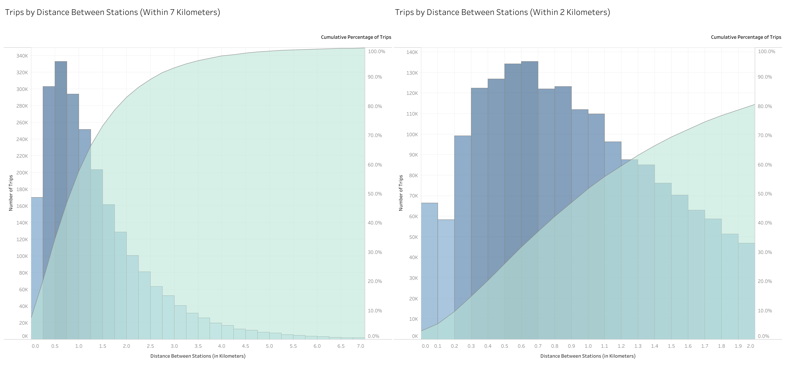

# bikesharing

## Overview

The purpose of this analysis was to use Tableau to visualize Citi Bike trip data from New York City in August 2019. Creating this visualization entailed producing sheets and formatting them into dashboards and a story.

## Results

My Tableau story, [Visualizing Citi Bike Trip Data](https://public.tableau.com/app/profile/colin.brineman/viz/VisualizingCitiBikeTripData/VisualizingCitiBikeTripData?publish=yes), includes 6 points, each consisting of 1 dashboard containing 2 sheets each.

### Trips by Duration
1. Trips by Duration (for All Users)
2. Trips by Duration (by Gender)

The only novel thing I did here was passing the count of trips for all users into the color marker, which doesn't necessarily make the information presented more memorable, but it does look, for lack of a better word, "cool."

### Trips by Day & Time
1. Trips by Day & Time (for All Users)
2. Trips by Day & Time (by Gender)

I further abbreviated the days of the week to single letters for the gender breakdown, since otherwise it was too busy. I also created a new column containing the days of the week for each trip as strings, so that I could include the full word for each day in the tooltip (I just think it looks better that way).
   
### Trips by Gender & User Type
1. Trips by Gender & User Type (by Day)
2. Trips by Gender & User Type (by User Type)

This is a chart that I created because I was interested in the gender breakdown of subscribers vs. customers. This chart was not one which we had to create for the module or the challenge.

### Average Trip Duration by Age
1. Average Trip Duration by Age (Raw Data)
2. Average Trip Duration by Age (Filtered Data)

I altered the X-axis to be years of age rather than date of birth (by subtracting date of birth from 2019). The data from Citi Bike was catastropically flawed. It included a huge spike in observations for riders aged 50, and none of the data after ~80 years was trustworthy, not least of all because it included cyclists who were allegedly 130 years old (no one has ever lived to be that old in all of documented human history). By graphing the percentage of trips for that age group on top of average trip duration, it is easy to see that the data is flawed. So I filtered out years with "too many" or "too few" observations (a process which was admittedly subjective). I also think that the percentage of trips for each year of age provides interesting new information.

### Trips by Station
1. Trips by Station (Start Station)
2. Trips by Station (End Station)

I cleaned up this data a little bit by removing stations that were outside of the city limits of New York. I added a layer of zip codes, included the name of the station in the tooltip, and changed the labels for the size legend.
  
### Trips by Distance Between Stations
1. Trips by Distance Between Stations (Within 7 Kilometers)
2. Trips by Distance Between Stations (Within 2 Kilometers)

Not only are these graphs completely outside of the requirements for the module or the challenge, but I even had to calculate new data using geopy. See line 7 of my [Jupyter notebook](jupyter/NYC_Citibike_Challenge.ipynb) for my method of calculating distance. I was interested in making these charts because from the Trips by Station maps it was clear that the most popular start stations were pretty close to the most popular stop stations.

## Summary

I will forgo suggesting 2 additional visualizations, since I actually created 3 additional visualizations for this project.

My takeaway is that Citi Bike needs to do a better job of enticing women to use their product — not only as customers, but as subscribers (a greater proportion of men's trips are from subscribers vs. women's trips). Citi Bike is quite clearly being used primarily for short distance travel, which suggests that, for many people, it has become a means of commute (rather than, e.g., a form of exercise). I would venture to guess that part of why Citi Bike doesn't have more women customers is due to the association of riding a bike in a city with danger (not unreasonable, given that cyclists do get injured quite a lot). Women are demonstrably more risk-averse than men. Thus, it seems reasonable to suppose that Citi Bike could entice more women customers by emphasizing that their product can save them money on their commute (because everyone likes saving money & women are part of everyone; moreover, women may be more budget-conscious than men).